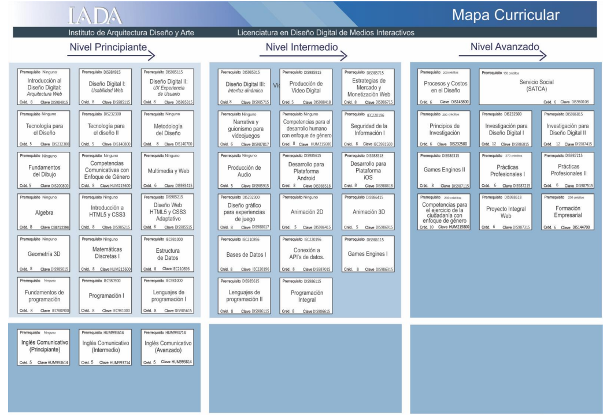

# ¿Cómo elegí DDMI? Mi historia entre diseño, desarrollo y muchos tropiezos

Cuando terminé la preparatoria, en 2015, tomé mi primera gran decisión: estudiar Ingeniería en Sistemas en el Tecnológico de Ciudad Juárez. Me duró menos de un año.\
La razón es sencilla (y hasta me da pena admitirla): **me morí de miedo con las matemáticas**.

En aquel entonces circulaba el rumor de que, si no terminabas la carrera en 12 semestres, te expulsaban sin posibilidad de recursar o graduarte. Hoy creo que era exagerado, pero en ese momento no quise averiguarlo. Renuncié.

Mi siguiente opción era la UACJ, también en Ingeniería en Sistemas, pero sentía que iba a repetir la misma historia. Si iba a cambiar, tenía que ser por algo completamente diferente… y además yo no pagaba mis estudios, así que no podía “estar probando”.

Así fue como, por recomendación de un amigo, terminé eligiendo **Diseño de Medios Interactivos (DDMI)**.

---

# La vida en DDMI: del confort al caos

Los primeros semestres fueron un respiro. Yo ya sabía HTML y un poco de CSS —armaba blogs en Blogger y cambiaba las plantillas cada dos días—, así que las materias iniciales relacionadas con desarrollo web me hicieron sentir en terreno conocido.

Tomé “Lenguajes de Programación” (que reprobé la primera vez), pero aun así me encantaba estar rodeado de código. Aunque DDMI pertenece al área de artes, tenía que tomar algunas materias en el IIT, y ahí era literalmente *el bicho raro*: un “artista” entre ingenieros.

Mientras avanzaba, me fui metiendo cada vez más en el mundo del desarrollo. No me quedé con lo de clase: hacía plantillas, copiaba diseños de redes sociales, y hasta jugué con bases de datos antes de llevar la materia. Sentía que ese era mi camino.

Hasta que la carrera me recordó que **DDMI no es Ingeniería**.

### Choqué con una realidad

De pronto, llegó el bloque pesado de diseño:

- Photoshop, Illustrator, InDesign
- Producción de video
- Producción de audio
- Animación 2D y 3D
- Narrativa y guionismo para videojuegos (esta es la materia que menos sentido tiene en toda la curricula. No solo eso, sino que es bastante tediosa y aburrida)

Todo sonaba muy “creativo”, pero para mí fue un infierno.\
Empecé a reprobar, a soltar materias a la mitad, a perder motivación.

---

# ¿Entonces no te gustó la carrera?

Curiosamente… **sí me gustó**, y mucho, al principio. Disfrutaba la parte técnica, destacaba en clase, y programaba todo el día. Eso me abrió las puertas a mi primer trabajo como desarrollador, allá por 2017–2018.

Pero debo ser sincero:\
**la estructura de la carrera se siente extremadamente dispersa**.

Brincas de desarrollo web a bases de datos (como si te encaminara a ingeniería), luego a Photoshop, luego a edición de video, luego a audio, luego a seguridad informática, luego a guionismo, luego a motores de videojuegos.\
Y cuando crees haber entendido la dirección, vuelve a cambiar.

Incluso hoy —cuatro años después de graduarme— sigo preguntándome por qué la malla curricular mezclaba tantos caminos sin un hilo claro. Me sentía como un muñeco de trapo hecho de parches: ¿era diseñador gráfico? ¿editor de video? ¿programador? ¿animador? ¿modelador 3D? ¿todo y nada a la vez?

---

# A mitad de la carrera: crisis y realidad

En el nivel intermedio ya estaba harto. Me arrepentía de mis decisiones.\
Algunos profesores incluso me dijeron que yo “no era diseñador”, sino ingeniero.\
Y sí, me sentía fuera de lugar.

Y aquí viene lo curioso: **todo eso sí me sirvió**.

Aunque DDMI no me especializó en nada, me obligó a salir de mi zona de confort y a tocar tantas áreas distintas que, con el tiempo, pude unir las piezas.

### Un ejemplo real

Tomé Games Engines pensando que no serviría de nada. En 2019, en mi trabajo tuvimos que usar Kinect con Unity. Yo, terco, no quería tocar nada que no fuera web. Pero cuando finalmente entendí el engine, comprendí cosas como POO y abstracción de una forma visual que no había logrado antes.

Lo mismo pasó con diseño: cuando el equipo de diseño estaba ocupado, yo podía modificar imágenes, crear mockups o ajustar recursos porque ya había aprendido lo básico.

Era un trapo parchado, sí.\
Pero esos parches hoy me permiten trabajar con IA para diseño, para desarrollo, para flujos, mockups, decisiones de UX, documentación, prototipos y más.

---

# ¿Entonces recomiendas DDMI?

**Depende de lo que buscas.**

En mi generación:

- 5 son diseñadores
- 2 son profesores
- 3 somos programadores

Si tu objetivo es ser ingeniero, altamente técnico, y quieres un título que pese en la industria mexicana, quizá sí te recomendaría una ingeniería.\
El ego me sigue diciendo que hubiera querido terminar una.\
Pero si quieres una carrera donde toques de todo y estés dispuesto a especializarte por tu cuenta, DDMI puede darte muchísimas herramientas.

Eso sí:\
Materias como “Desarrollo iOS/Android” nunca tuvieron sentido. En 2019 ya podíamos haber visto PWAs, responsive avanzado o frameworks modernos. Hubiera sido un antes y un después.

Y si algún profesor llega a leer esto:\
**obligar al alumno a ir a la universidad para compilar en Mac solo para pasar la clase es absurdo**.

---

# Conclusión: ¿vale la pena?

Si estás pensando en estudiar DDMI, considera esto:

**Vas a ser mitad diseño, mitad desarrollo.**\
No hay escapatoria.\
Y muchos recorren un camino como el mío, pero al revés: aman el diseño y sufren en la parte técnica.

No es una carrera especializada: es una caja de herramientas.\
Y lo que hagas con esas herramientas depende totalmente de ti.

#### Un último consejo sobre los Hackathones de DDMI

Antes de cerrar, quiero darte un consejo que ojalá alguien me hubiera dado a mí: **si algún día participas en el Hackathon de DDMI (ese evento anual que algunos profesores tratan casi como requisito), no te desgastes desarrollando. Diseña**.

En serio.\
El 100% de los hackathones en los que participé se evaluaban por su documentación y su presentación visual, no por el código. Recuerdo que una vez hice una aplicación completa, incluso un juego multiplayer —fue un dolor de cabeza— y aun así ganó el equipo que tenía el diseño más bonito.

Ahí es donde se refleja claramente el espíritu de la carrera: **no se trata del desarrollo, sino de lo que presentas**.

En mis tiempos eran 30 horas seguidas sin dormir. En mi último hackathon, ya en plena pandemia, trabajamos por Teams, hicimos únicamente el diseño (y un video de una demo, que en el fondo estaba todo bugueado, pero para demo servía bastante)… y aun así ganamos segundo lugar. Sin desveladas, sin rompernos la cabeza programando.

Ese es el punto: **en DDMI no gana quien programa mejor**, gana quien comunica mejor.

Ahora, con todo el auge de la IA y el coding asistido, no sé cómo se viva actualmente. Pero esa fue mi experiencia, y creo que vale la pena que la tengas en mente.
